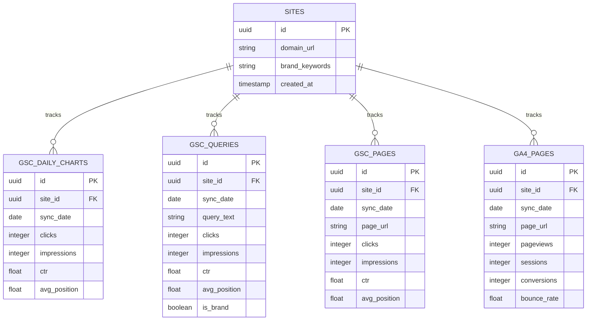
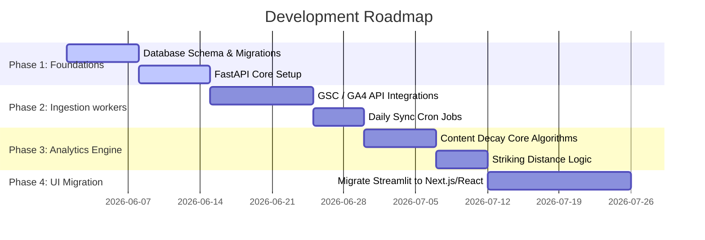

# SEO Polaris: System Architecture Specification

This specification defines the production-grade transition architecture for **SEO Polaris**, evolving the platform from a local Pandas/Streamlit PoC into a scalable, multi-user enterprise SEO intelligence application powered by **FastAPI**, **PostgreSQL**, the **Google Search Console API**, and the **GA4 API**.

---

## 1. Folder Structure

A monorepo layout is recommended to keep data models, backend API controllers, and workers together:

```text
seo-polaris/
├── .github/workflows/          # CI/CD pipelines
├── backend/
│   ├── app/
│   │   ├── __init__.py
│   │   ├── main.py             # FastAPI entrypoint
│   │   ├── core/               # Configuration, security, database sessions
│   │   │   ├── config.py
│   │   │   ├── db.py
│   │   │   └── security.py
│   │   ├── models/             # SQLAlchemy ORM schemas
│   │   │   ├── site.py
│   │   │   ├── gsc.py
│   │   │   └── ga4.py
│   │   ├── schemas/            # Pydantic validation schemas
│   │   │   ├── dashboard.py
│   │   │   └── site.py
│   │   ├── api/                # REST endpoints
│   │   │   ├── v1/
│   │   │   │   ├── auth.py
│   │   │   │   ├── dashboard.py
│   │   │   │   └── sites.py
│   │   └── services/           # Business logic (decay algorithms, uplift)
│   │       ├── decay.py
│   │       └── striking.py
│   ├── migrations/             # Alembic database migrations
│   └── requirements.txt
├── workers/                    # Data ingestion cron tasks
│   ├── sync_gsc.py             # Daily GSC API worker
│   ├── sync_ga4.py             # Daily GA4 API worker
│   └── scheduler.py
├── frontend/                   # UI (Vite + React / Next.js)
│   ├── src/
│   │   ├── components/         # Reusable charts, KPI blocks
│   │   ├── pages/              # Overview, Queries, Decay, Striking Distance
│   │   └── services/           # Fetch APIs
│   ├── package.json
│   └── tailwind.config.js
└── README.md
```

---

## 2. Database Schema

A relational PostgreSQL database will store historic, high-granularity search data.



### SQL Schema DDL (PostgreSQL)
```sql
-- Sites metadata
CREATE TABLE sites (
    id UUID PRIMARY KEY DEFAULT gen_random_uuid(),
    domain_url VARCHAR(255) NOT NULL UNIQUE,
    brand_keywords TEXT, -- Comma-separated list
    created_at TIMESTAMP WITH TIME ZONE DEFAULT CURRENT_TIMESTAMP
);

-- Daily performance aggregates (corresponds to GSC "Chart" sheet)
CREATE TABLE gsc_daily_charts (
    id UUID PRIMARY KEY DEFAULT gen_random_uuid(),
    site_id UUID REFERENCES sites(id) ON DELETE CASCADE,
    sync_date DATE NOT NULL,
    clicks INTEGER DEFAULT 0,
    impressions INTEGER DEFAULT 0,
    ctr DOUBLE PRECISION,
    avg_position DOUBLE PRECISION,
    UNIQUE (site_id, sync_date)
);

-- Daily Query Performance
CREATE TABLE gsc_queries (
    id UUID PRIMARY KEY DEFAULT gen_random_uuid(),
    site_id UUID REFERENCES sites(id) ON DELETE CASCADE,
    sync_date DATE NOT NULL,
    query_text VARCHAR(1000) NOT NULL,
    clicks INTEGER DEFAULT 0,
    impressions INTEGER DEFAULT 0,
    ctr DOUBLE PRECISION,
    avg_position DOUBLE PRECISION,
    is_brand BOOLEAN DEFAULT FALSE,
    UNIQUE (site_id, sync_date, query_text)
);
CREATE INDEX idx_gsc_queries_lookup ON gsc_queries (site_id, sync_date);

-- Daily Page Performance
CREATE TABLE gsc_pages (
    id UUID PRIMARY KEY DEFAULT gen_random_uuid(),
    site_id UUID REFERENCES sites(id) ON DELETE CASCADE,
    sync_date DATE NOT NULL,
    page_url VARCHAR(2048) NOT NULL,
    clicks INTEGER DEFAULT 0,
    impressions INTEGER DEFAULT 0,
    ctr DOUBLE PRECISION,
    avg_position DOUBLE PRECISION,
    UNIQUE (site_id, sync_date, page_url)
);
CREATE INDEX idx_gsc_pages_lookup ON gsc_pages (site_id, sync_date);

-- Daily GA4 Metrics mapped by URL
CREATE TABLE ga4_pages (
    id UUID PRIMARY KEY DEFAULT gen_random_uuid(),
    site_id UUID REFERENCES sites(id) ON DELETE CASCADE,
    sync_date DATE NOT NULL,
    page_url VARCHAR(2048) NOT NULL,
    pageviews INTEGER DEFAULT 0,
    sessions INTEGER DEFAULT 0,
    conversions INTEGER DEFAULT 0,
    bounce_rate DOUBLE PRECISION,
    UNIQUE (site_id, sync_date, page_url)
);
```

---

## 3. Core API Endpoints

FastAPI will expose endpoints to feed charts and table explorers on the frontend.

| Method | Endpoint | Description | Request Parameters |
| :--- | :--- | :--- | :--- |
| **GET** | `/api/v1/dashboard/summary` | Combined site health KPI scores. | `site_id`, `start_date`, `end_date`, `brand_mode` |
| **GET** | `/api/v1/dashboard/trends` | Time-series chart dataset. | `site_id`, `start_date`, `end_date`, `metric` |
| **GET** | `/api/v1/queries` | Search queries list with filters. | `site_id`, `start_date`, `end_date`, `search`, `brand_mode`, `limit`, `offset` |
| **GET** | `/api/v1/pages` | Pages with search & performance tier status. | `site_id`, `start_date`, `end_date`, `search`, `limit`, `offset` |
| **GET** | `/api/v1/intelligence/striking-distance` | Ranks 4-15 with click potential. | `site_id`, `benchmark_ctr` |
| **GET** | `/api/v1/intelligence/decay` | Computes historical drop-offs. | `site_id`, `compare_days` (default 30) |
| **POST** | `/api/v1/sync/gsc` | Manually triggers daily sync. | `site_id`, `target_date` |

---

## 4. Development & Implementation Roadmap

The project is structured into four distinct development cycles to enable continuous delivery:



### Phase 1: Database and Backend Architecture (2 Weeks)
*   Deploy PostgreSQL database instances.
*   Write SQLAlchemy models and configure database migrations using Alembic.
*   Structure the baseline FastAPI server with routing and authentication guards.

### Phase 2: API Integrations and Data Pipeline (2 Weeks)
*   Establish Google OAuth2 credentials and GSC / GA4 read permissions.
*   Implement background workers in `workers/` to run daily and pull data batch tasks, upserting results into database tables.

### Phase 3: Analytics Engine & Logic (1.5 Weeks)
*   Write database queries computing content decay by comparing the trailing 30 days vs the preceding 30 days.
*   Add dynamic Brand vs. Non-brand categorization filters executing on the SQL engine side rather than in-memory.

### Phase 4: Client-side UI Refactoring (2 Weeks)
*   Migrate the Streamlit prototype to a dedicated frontend dashboard built with React (or Next.js) and TailwindCSS.
*   Utilize chart libraries (e.g., Tremor or Recharts) to recreate the custom dark-mode area charts and donut visualizers.
