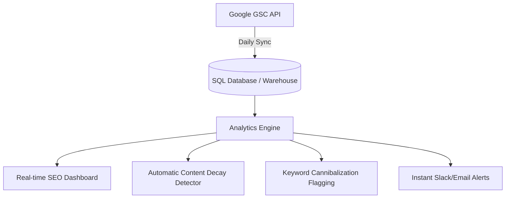

# SEO Polaris: SEO Intelligence Platform Proposal

This proposal outlines the strategic plan for **SEO Polaris**, a custom SEO intelligence platform modeled after tools like SEO Gets, designed for internal company use. The platform will initially consume Excel exports from Google Search Console (GSC) as a Proof of Concept (PoC) before upgrading to live GSC API integrations.

---

## 1. GSC Export Data Structure Analysis

The GSC export file ([whistle_data.xlsx](file:///c:/Users/Bhavya%20Patela/SEOPolaris/Data/whistle_data.xlsx)) consists of the following sheets:

| Sheet Name | Key Columns | Shape / Size | Purpose |
| :--- | :--- | :--- | :--- |
| **Chart** | `Date`, `Clicks`, `Impressions`, `CTR`, `Position` | 89 rows (3 months) | High-level daily time-series performance metrics. |
| **Queries** | `Top queries`, `Clicks`, `Impressions`, `CTR`, `Position` | 1000 rows | Aggregate performance per keyword search query. |
| **Pages** | `Top pages`, `Clicks`, `Impressions`, `CTR`, `Position` | 1000 rows | Aggregate performance per landing page URL. |
| **Countries** | `Country`, `Clicks`, `Impressions`, `CTR`, `Position` | 231 rows | Geographic traffic distribution. |
| **Devices** | `Device`, `Clicks`, `Impressions`, `CTR`, `Position` | 3 rows | Mobile vs. Desktop vs. Tablet breakdown. |
| **Search appearance** | `Search Appearance`, `Clicks`, `Impressions`, `CTR`, `Position` | 2 rows | Rich snippet results (e.g., "Review snippet"). |
| **Filters** | `Filter`, `Value` | 2 rows | Contextual details of the export (e.g., search type: web). |

---

## 2. Most Valuable Dashboard Widgets

To empower the SEO team with quick, actionable signals, the following interactive dashboard widgets are proposed:

### A. Performance Scorecards (KPI Header)
*   **Metrics**: Total Clicks, Total Impressions, Average CTR, Average Position.
*   **Visual**: Sleek cards with sparklines showing the trend of each metric over the selected timeframe and a green/red percentage indicator showing period-over-period performance (e.g., comparing current 30 days to the previous 30 days).

### B. Dual-Y Axis Performance Trend Chart
*   **Visual**: Area/line chart overlaying **Clicks** (primary vertical axis) against **Average Position** (secondary inverted vertical axis, so rank #1 is at the top).
*   **Value**: Visualizes correlation between ranking increases/decreases and actual traffic changes.

### C. Query Bubble Chart (CTR vs. Position vs. Impressions)
*   **Visual**: A scatter plot where:
    *   **X-axis** = Average Position (inverted)
    *   **Y-axis** = CTR (%)
    *   **Bubble Size** = Impressions (showing search volume / potential)
*   **Value**: Quickly highlights "striking distance" keywords (Position 4-10 with low CTR but high impressions) that can be optimized for quick wins.

### D. Device and Rich Snippet Share (Donut Charts)
*   **Visual**: Clean, segmented donut charts showing Device split (Mobile/Desktop/Tablet) and Search Appearance contributions.
*   **Value**: Shows whether mobile usability optimization or schema markup is driving performance.

---

## 3. Daily Reports for an SEO Manager

An SEO manager needs daily summaries of search health to react immediately to traffic shifts:

### A. Keyword Volatility / Movement Report
*   **What**: Highlights keywords that experienced the largest rank shifts (winners & losers) compared to the previous day or week.
*   **SEO Action**: Diagnose if a core algorithm update, competitor content release, or technical site issue caused the movement.

### B. Brand vs. Non-Brand Traffic Segments
*   **What**: Automatically categorizes queries matching brand terms (e.g., queries containing "whistle") vs. generic terms.
*   **SEO Action**: Separates brand affinity (which SEO cannot directly influence) from generic search performance (the true measure of active SEO efforts).

### C. Landing Page Performance & Content Decay Alert
*   **What**: Identifies top pages showing a downward trend in clicks or position over the last 14 to 30 days.
*   **SEO Action**: Flags pages that are losing relevance or being outcompeted, signaling that it's time for a content refresh.

---

## 4. MVP Features (Version 1)

The initial version will focus on building a robust local dashboard around file ingestion:

*   **Excel/CSV Ingestor**: Drag-and-drop area to upload GSC exports and save them to a local sqlite database.
*   **Interactive Core Dashboard**: Filters for date range, device type, and country.
*   **Query & Page Explorers**: Interactive, searchable data tables with advanced sorting and regex filter capabilities (e.g., excluding brand queries).
*   **Interactive Trend Visuals**: Interactive line/area charts using Streamlit/Altair for daily trend tracking.

---

## 5. Future API-Driven Features

Once connected directly to the **Google Search Console API**, the platform's capabilities will scale significantly:

*   **Unlimited Historical Data**: GSC exports are capped, and the GSC UI stores only 16 months. The API will feed a local data warehouse to build year-over-year reports and multi-year trend analysis.
*   **Automated Daily Syncing**: Eliminates manual Excel exporting.
*   **Keyword Cannibalization Detector**: Automatically flags multiple pages ranking for the exact same query, which splits click-through rates.
*   **Slack/Email Alert System**: Triggers notifications if clicks on a top-performing page drop below a rolling threshold.

---

## 6. Business Value-Driven Roadmap

We propose structuring development into four logical iterations to deliver immediate business value while building towards a fully automated intelligence hub:

### Phase 1: Interactive PoC & Ingestor (Weeks 1-2)
*   **Goal**: Get the SEO team using the tool immediately with existing Excel exports.
*   **Deliverables**:
    *   Dynamic Streamlit UI.
    *   File upload system parsing GSC Excel files.
    *   Key KPI scorecards and trend charts.
    *   Searchable/filterable tables for Queries and Pages.

### Phase 2: Segmentations & Deep Analysis (Weeks 3-4)
*   **Goal**: Turn raw metrics into strategic decisions.
*   **Deliverables**:
    *   Brand vs. Non-Brand automatic categorization toggle.
    *   Striking distance keyword highlighting.
    *   Query-to-Page mapping (identifying which queries drive traffic to which landing page).

### Phase 3: DB Warehousing & GSC API Integration (Weeks 5-7)
*   **Goal**: Automate data pipelines and remove export limits.
*   **Deliverables**:
    *   OAuth2 flow for Google Search Console API.
    *   Local/Cloud database schema to store historic metrics perpetually.
    *   Automated daily sync cron jobs.

### Phase 4: Proactive Alerts & Content Intelligence (Weeks 8-10)
*   **Goal**: Transition from a reactive dashboard to an active assistant.
*   **Deliverables**:
    *   Content Decay algorithm reporting pages needing optimization.
    *   Cannibalization warnings.
    *   Slack notification integrations for metric drops.
